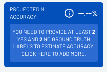
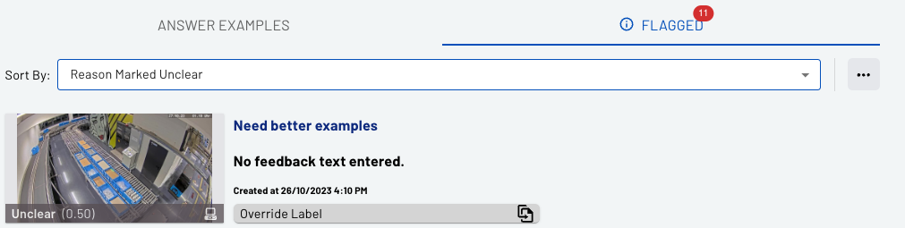

Want to get the best chance of success from your new Groundlight detectors? Here are five suggestions from the Groundlight science team that can help you get the best performance possible. 

Come at it from the point of view of making answering your image query question as easy as possible. 
Pretend you’re explaining the task to a novice. What would you need to do to set them up for success?

<!-- truncate -->

## Phrase the question right
You will have more success asking questions that can in principle be answered by a reasonable person 
simply by looking at a single image from the detector. 

:white_check_mark: **DO:** "Is there a part staged in front of the robot ready for picking up?"   
:x: **DON'T:** "Am I awesome?"

Think about how you will use the output of your detector, so the Yes and No answers align with your expectations. A technically correct answer to a vague question may be of no use to you. For example, if you have a camera pointing down on a kitchen range and would like to get an alert if there's a fire, phrase the query so that normal gas burner flames are excluded. 

:white_check_mark: **DO:** "Is there a fire in the pan? (Ignore normal gas burner flames)"  
:x: **DON'T:** "Is there a fire?"

## Put details in the notes
Is any specialized knowledge required to answer your query? 
Use the notes dialog to provide explanations of any assumed knowledge or definitions of technical terms. 
Like in the fire extinguisher example above, consider adding short definitions inside the text of the query. 
 
:white_check_mark: **DO:** “Is the fiducial (etched arrow on the gear surface) aligned with the painted chain link?”  
:white_check_mark: **DO:** “Is the fence fully closed? (Metal bar on the fence must be touching the plywood wall)”

Here’s an example of detailed notes for a detector asking “Is there a streetcar visible? READ NOTES”: 

In this case, the customer even drew on the example images to point out where the street car might appear. 
Detailed notes may be especially useful if the question is about a smaller region of the scene in the image.

## Think of edge cases
How do you want to treat unclear or edge cases?
Sometimes it’s impossible to answer the question based on the image, for example, when it’s too dark 
at night to tell, or the view is temporarily obstructed by something moving in front of the camera. 
Do you know how you’d like to treat those cases? 

:white_check_mark: **DO:** Add notes like “If the image is too dark to tell, the answer should be YES.”

In the fire extinguisher example below, the customer wrote “If you can’t see the fire extinguisher, 
it is blocked” inside the query text, drawing attention to the most important potential edge case.

[.")](./images/2023-12-15-best-practices/fire_extinguisher_blocked_yes.png)

Detailed notes on foreseeable edge cases will prevent confusion by backend labelers and result in 
quicker learning for your detector at less cost to you. 

## Seed with a few examples
It helps to add a few labels yourself early on, in order to provide good examples for backend labelers and the 
new ML model. For best results, if you have example images for both YES and NO answers, send 
them through early on, and add the corresponding labels. Having at least 2 customer “ground truth” 
answers for each class of Yes or No will also give you ML performance metrics on your detector.

## Only you know the truth
Check periodically under the Flagged tab on your detector's detail page to see if any images may still be confusing. Click on the "Override Label" button to provide the correct answer in those cases. 

It's also good practice to continue adding a few ground truth labels here and there by clicking on the “Keep labeling” button 
on the detector details page, in order to get tighter confidence bounds on your detector’s performance metrics.

---
> :mortar_board: *Watch this space for a forthcoming in-depth discussion of confidence bounds*
---

If you notice labeling mistakes, correct them by providing your own answer. Then consider adding 
extra instructions in the notes. You can upload screenshots or images inside the notes dialog too. 
Our labeling staff will be notified whenever you make changes to your notes so they stay up to date with how you want your detector to behave and can quickly address misconceptions.

## [Ready to start?](https://app.groundlight.ai)

We hope these tips give you a great start. If you haven’t already, you can sign up for a free account at https://app.groundlight.ai. Dive into [Groundlight Pi-Gen](https://github.com/groundlight/groundlight-pi-gen) for a hassle-free introduction to AI-powered computer vision on Raspberry Pi.

If you have any questions, please reach out to us on the in-application chat or via email to support@groundlight.ai.

