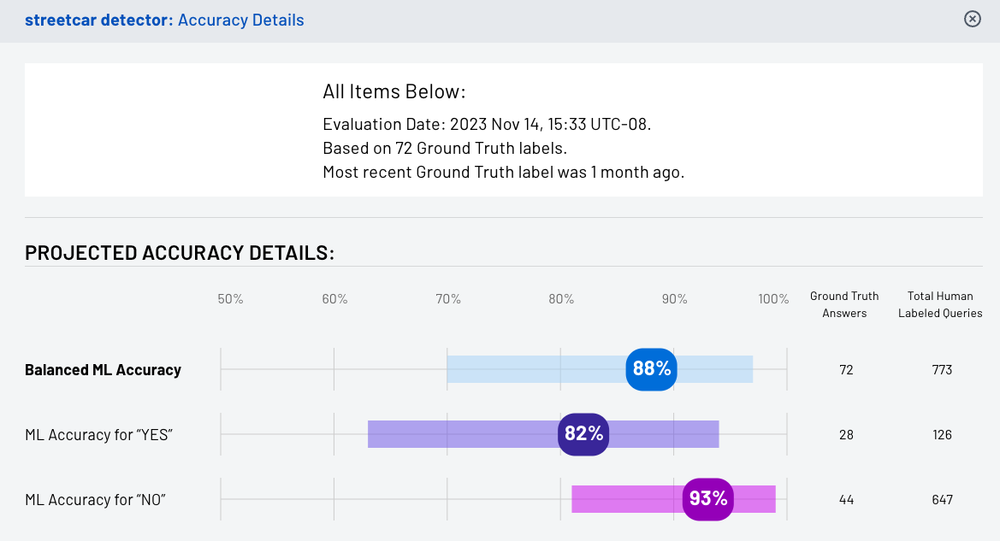

At Groundlight, we put careful thought into measuring the correctness of our machine learning detectors. In the simplest case, this means measuring detector accuracy. But our customers have vastly different performance measurement needs since our platform allows one to train an ML model for virtually any Yes/No visual question-answering task. A single metric like accuracy is unlikely to provide adequate resolution for all such problems. Some customers might care more about false positive mistakes (precision) than false negative ones (recall), whereas others might care about false negatives.

<!-- truncate -->

To provide insight into detector performance for such varied use cases, yet still summarize performance with a single number, Groundlight's **accuracy details** view displays a detector's [balanced accuracy](https://scikit-learn.org/stable/modules/model_evaluation.html#balanced-accuracy-score). Balanced accuracy is the average recall across all classes and is the prefered summary metric at Groundlight. For binary problems, this is just the mean of the accuracy on the YESs and the accuracy on the NOs. We like balanced accuracy because it is more intuitive and easier to understand than metrics like the F1 score or AUROC. And many commercially interesting problems are highly imbalanced - that is the answer is almost always NO, with very few YESs, or vice versa. For such problems, standard accuracy is not a good measure because always predicting the most common class will yield high accuracy, but will be useless in practice.

However, displaying the balanced accuracy alone is still not very informative as we do not always have an ample supply of **ground truth** labeled images to estimate it from. (Ground truth labels are answers to image queries that have been provided by customers or a knowledgeable customer representative, and are therefore guaranteed to be correct.) With only few ground truth labeled images, our estimate of a detector's balanced accuracy may be imprecise. As such, we've found it helpful to quantify and display just how accurate the detector's balanced accuracy estimate is by computing and displaying confidence intervals for the reported balanced accuracy. And this brings us to the subject of this blog post.

At Groundlight, we compute exact confidence intervals to upper and lower bound each detector's balanced accuracy. The detector's accuracy details view (figure 1 above) shows them as colored bars surrounding the reported accuracy number. This blog post describes how we compute these exact confidence intervals using the tails of the binomial distribution, and it also provides associated intuition along with the math.

Unlike the confidence intervals based on the Gaussian distribution which you may be familiar with, confidence intervals based on the binomial tails are exact and always valid, regardless of the number of ground truth labels available. Our exposition largely follows [Langford, 2005](https://jmlr.org/papers/v6/langford05a.html) and we use his "program bound" as a primitive to construct confidence intervals for the balanced accuracy metric.

## Background

To estimate and construct confidence intervals for balanced accuracy, we first need to know how to construct confidence intervals for "plain old" standard accuracy. So we'll start here.

Recall that plain old accuracy is just the fraction of correct predictions that a classifier makes. To define this fraction rigorously, we make the assumption that there's a fixed distribution over the set of possible examples that our classifier might encounter. This distributional assumption helps us talk meaningfully about the classifier's "true accuracy". And to make it clear why it's needed, consider the case that our classifier performs well on daytime images but poorly on nighttime images. If the underlying distribution consists mainly of daytime images, then our classifier's accuracy will be high, but if it's mostly nighttime images, the accuracy will be low. Thus, the classifier's true accuracy is implicitly a function of the distribution of examples it's applied to. We almost never know what this distribution is (in fact, it's mainly a mathematical fiction, but a useful one). But for our classifier to possess something like a Platonic "true accuracy" that is immutable, we assume a distribution over examples that remains static and fixed.

$$
\pi = 4
$$
