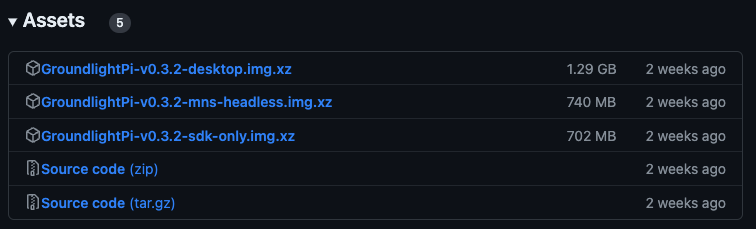
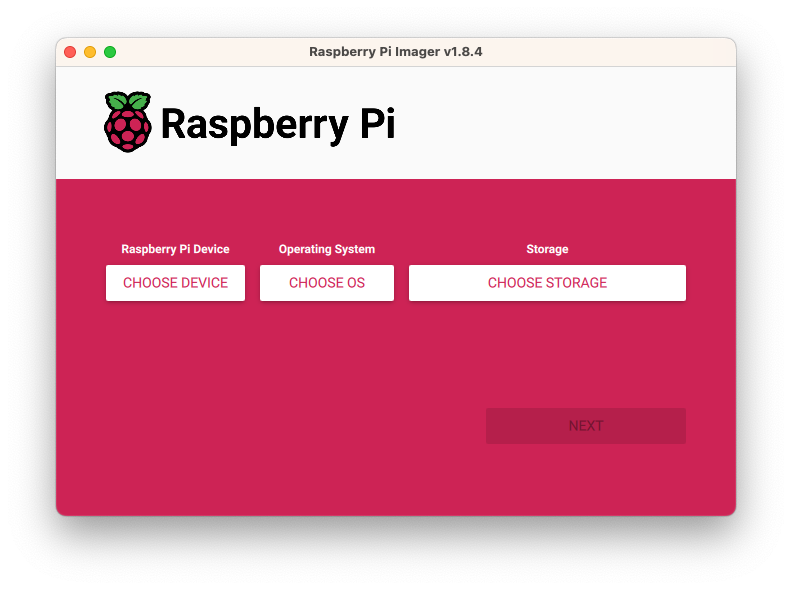
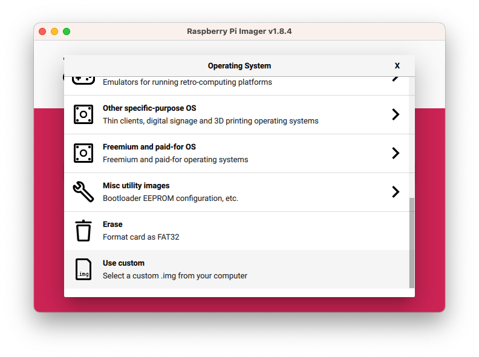
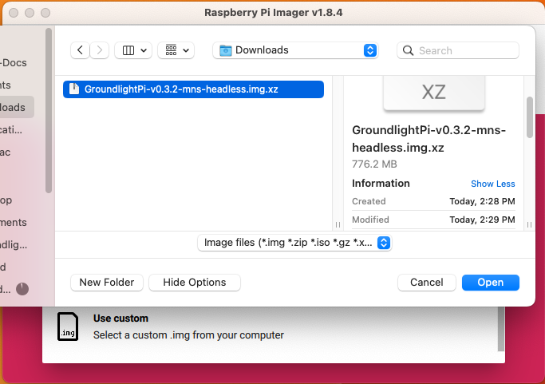
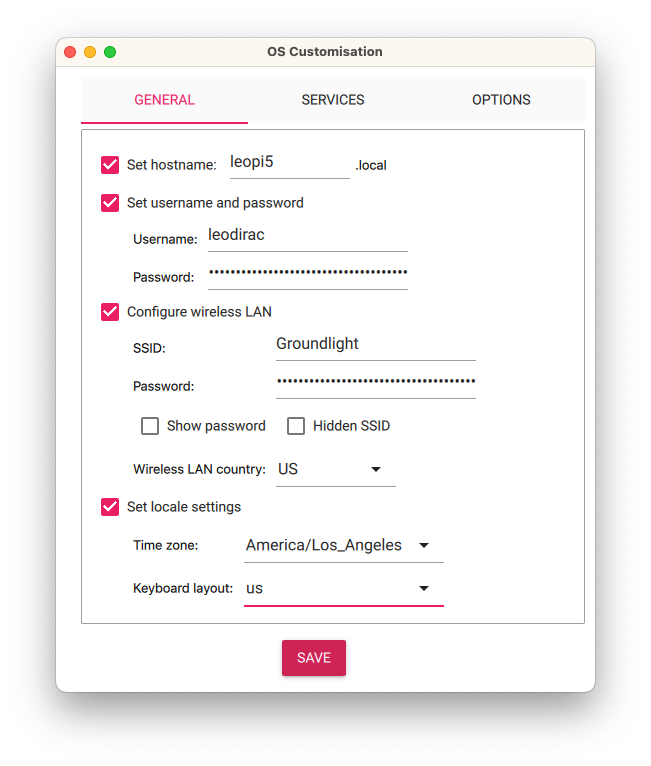

Happy New Year everybody!  If you got a fancy new Raspberry Pi 5 for Christmas, you might be wondering what to do with it.  Well, we have a suggestion:  build a computer vision application with it!  And we have all the tools you need to get started.

Raspberry Pi offers a great platform for computer vision (CV), ranging from home hobby projects to serious industrial applications. However, setting up a Raspberry Pi for computer vision can be a time-consuming process. [Groundlight Pi-Gen](https://github.com/groundlight/groundlight-pi-gen), simplifies the setup process by providing ready-to-use OS images for Raspberry Pi.

<!-- truncate -->

(Note that here, when we say "image" we mean an OS image, which is a file containing a snapshot of an operating system - linux - that can be installed onto a new machine.  These are not photos or pictures, which are also of course important in computer vision.  Oh jargon...)

## Raspberry Pi OS Images pre-built with Computer Vision Software
To download a Linux image for your Raspberry Pi, loaded with all the software you need for computer vision, 
go to the [releases](https://github.com/groundlight/groundlight-pi-gen/releases) section in Groundlight Pi-Gen to find Raspberry Pi OS images (`.img.xz` files) that have pre-configured software environments for computer vision. These images are ready to be flashed onto a Raspberry Pi.

These include a fast, modern version of python (3.11), along with key libraries like [OpenCV](https://opencv.org/) for classic algorithms and device management, [Numpy](https://numpy.org/) for fast math, [FrameGrab](https://code.groundlight.ai/python-sdk/blog/introducing-framegrab) for declarative access to image sources, and of course [Groundlight](https://pypi.org/project/groundlight/) for fully-managed visual understanding models.  We've set up a `venv` for you to avoid the dreaded "externally-managed-environment" error which plagues many newer python versions, while still letting you use good-old `pip` to add more.  (We like `poetry` and `conda`, and these will also work fine if you prefer them.)

There are several flavors of OS image available.  The smaller ones are suitable for headless use, while the larger ones include a desktop GUI with a browser.  The key differences are the size of the download and the amount of time it takes to flash the image onto a microSD card.  The [available flavors in the current release](https://github.com/groundlight/groundlight-pi-gen/releases) are:

- `desktop`: Image with Groundlight MNS and a desktop GUI with a browser.  Appropriate for a Raspberry Pi with a screen attached.
- `mns-headless`: Image with Groundlight Monitoring Notification Server (MNS) for headless use.
- `sdk-only`: Minimal image with the Python SDK and core libraries.  Suitable for headless use on smaller Raspberry Pi models such as the Pi Zero.

A couple more flavors you might be interested in: We're planning a [kiosk mode](https://github.com/groundlight/groundlight-pi-gen/issues/15) for the desktop image, so that you can run a Groundlight MNS instance on a Raspberry Pi with a screen attached, and have it automatically start up in a browser.  
Also note that the `edge` version which will download and run the ML models locally is not yet supported on Raspberry Pi, because the edge models requires a CUDA GPU.

## Flashing the OS Image onto a microSD Card

Once you have [downloaded your image file](https://github.com/groundlight/groundlight-pi-gen/releases), the next step is to flash it onto a microSD card.  To do this, 
download the [Raspberry Pi Imager](https://www.raspberrypi.com/software/) software. 

After selecting your hardware type under "Choose Device", click "Choose OS" and scroll to the bottom to "Use custom".  

Then select the `.img.xz` file you downloaded.

Then choose your microSD card with the "Choose Storage" button, and then click "Next".  
You'll get a prompt asking "Use OS customization?" which is optional, but very cool.  Choose "Edit settings", and you
can set your Wi-Fi credentials, enable SSH login with a public key.

When you're done configuring settings, click "Save" and then "Yes" to confirm.  Writing the image to the microSD card will take a few minutes.  When it's done, just pop the SD card into your pi, and power it up!  If it all works properly, you'll be able to access your Raspberry Pi over the network without needing to plug in a keyboard, mouse, or monitor.  (We like to plug it into Ethernet for the first boot, because we find that the Raspberry Pi's Wi-Fi can be a bit finicky, even if properly configured.)

### No-code machine vision with Monitoring Notification Server (MNS)
If you opted to install the `desktop` or `mns-headless` image, you'll have a web application called the [Groundlight Monitoring Notification Server (MNS)](https://github.com/groundlight/monitoring-notification-server),
which is a web application that allows you set up a computer vision pipeline without writing any code, and have it notify you when it detects something of interest.

After setting up your Raspberry Pi with Groundlight OS, wait a few minutes for it to finish downloading everything, and then access the MNS by navigating to `http://[your-raspberry-pi's-IP-address]:3000` in a web browser, or if you're running the desktop version, open [`http://localhost:3000/`](http://localhost:3000).  

It will prompt you for your [Groundlight API token](docs/getting-started/api-tokens), which you can get with a free account at [app.groundlight.ai](https://app.groundlight.ai).  Then you can describe your visual query in natural language, and how you want the MNS to notify you when it detects something of interest.  For best-practices on how to describe your visual query, see [this blog post](https://code.groundlight.ai/python-sdk/blog/best-practices).

## Get Started for Free
To start building your own computer vision solutions, sign up for a free account at [app.groundlight.ai](https://app.groundlight.ai). Dive into Groundlight Pi-Gen for a hassle-free introduction to AI-powered computer vision on Raspberry Pi.

If you have any questions, please reach out to us on the in-application chat at [app.groundlight.ai](https://app.groundlight.ai) or on [GitHub](https://github.com/groundlight/python-sdk/issues).
