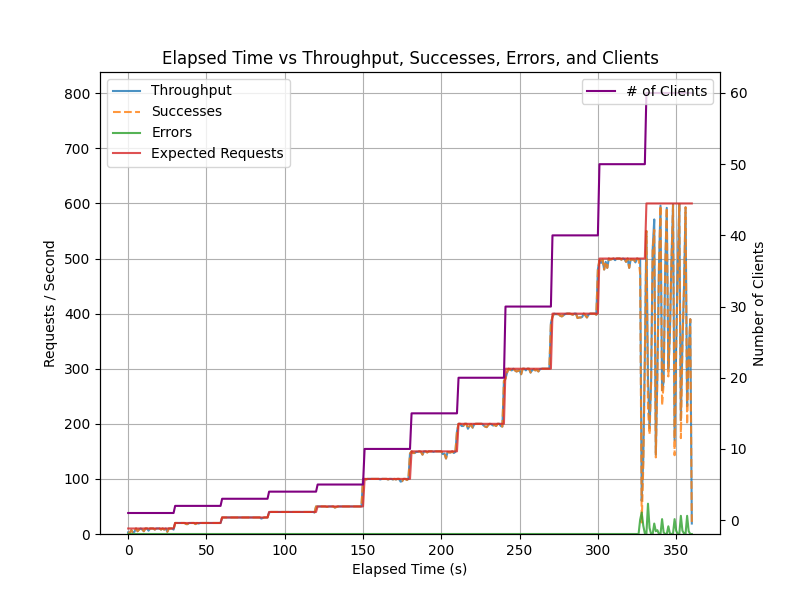
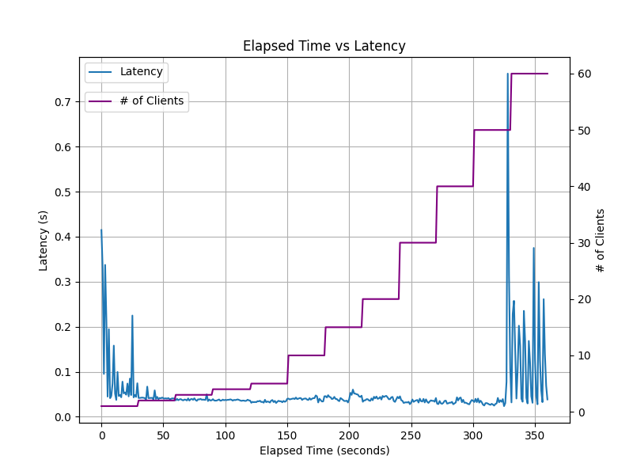

# Processing Images on the Edge

If your account includes access to edge models, you can download and install them on your edge devices. This allows you to run Groundlight's ML models locally on your edge devices, reducing latency and increasing throughput. Additionally, inference requests handled on the edge are not counted towards your account's usage limits.

This is achieved through a proxy service called the `edge-endpoint`, a lightweight, open-source service that runs on your edge devices. The `edge-endpoint` is responsible for downloading and running models and communicating with the Groundlight cloud service. You can find the source code and documentation for the `edge-endpoint` [on GitHub](https://github.com/groundlight/edge-endpoint).

## How the Edge Endpoint Works

The `edge-endpoint` is a [proxy service](https://en.wikipedia.org/wiki/Proxy_server) that runs on your edge devices. It intercepts requests and responses between your application and the Groundlight cloud service, enabling you to run Groundlight's ML models locally on your edge devices.

When your application sends an image query to the Groundlight cloud service, the `edge-endpoint` intercepts the request and downloads the relevant edge-sized model from the cloud. It then runs the model locally on the edge device and returns the result to your application. By default, it will return answers without escalating to the cloud if the edge model answers above the specified confidence threshold. Otherwise, it will escalate to the cloud for a more confident answer. This process also allows Groundlight to learn from examples that are challenging for the edge model. Once a new edge model is trained to handle such examples, it will automatically be downloaded to the edge device for future queries.

The `edge-endpoint` operates as a set of [containers](https://en.wikipedia.org/wiki/Containerization_(computing)) on an "edge device," which can be an NVIDIA Jetson device, a rack-mounted server, or even a Raspberry Pi. The main container is the `edge-endpoint` proxy service, which handles requests and manages other containers, such as the `inferencemodel` containers responsible for loading and running the ML models.

## Installing and Running the Edge Endpoint
To set up an `edge-endpoint` manually, please refer to [the deploy README](https://github.com/groundlight/edge-endpoint/blob/main/deploy/README.md).

Groundlight also provides managed `edge-endpoint` servers. Management is performed via [Balena](https://www.balena.io/). To received a managed `edge-endpoint`, please [contact us](mailto:info@groundlight.ai).

## Using the Edge Endpoint
To utilize the `edge-endpoint`, set the Groundlight SDK to use the `edge-endpoint`'s URL instead of the cloud endpoint. Your application logic can remain unchanged and will work seamlessly with the Groundlight `edge-endpoint`. This setup allows some ML responses to be returned much faster, locally.

Note that image queries processed at the `edge-endpoint` will not appear on the Groundlight cloud dashboard unless specifically configured. In such cases, the edge prediction will not be reflected in the cloud image query. Additional documentation and configuration options are available in the [edge-endpoint repository](https://github.com/groundlight/edge-endpoint#running-the-edge-endpoint).

To set the Groundlight Python SDK to submit requests to your `edge-endpoint` proxy server, you can either pass the endpoint URL to the Groundlight constructor like this:
```python notest
from groundlight import Groundlight
gl = Groundlight(endpoint="http://localhost:30101")
```

or set the `GROUNDLIGHT_ENDPOINT` environment variable like:
```bash
export GROUNDLIGHT_ENDPOINT=http://localhost:30101
python your_app.py
```

:::tip
In the above example, the `edge-endpoint` is running on the same machine as the application, so the endpoint URL is `http://localhost:30101`. If the `edge-endpoint` is running on a different machine, you should replace `localhost` with the IP address or hostname of the machine running the `edge-endpoint`.
:::

## Edge Endpoint performance

We have benchmarked the `edge-endpoint` handling 500 requests/sec at a latency of less than 50ms on an off-the-shelf [Katana 15 B13VGK-1007US](https://us.msi.com/Laptop/Katana-15-B13VX/Specification) laptop (Intel® Core™ i9-13900H CPU, NVIDIA® GeForce RTX™ 4070 Laptop GPU, 32GB DDR5 5200MHz RAM) running Ubuntu 20.04.

The following graphs show the throughput and latency of the `edge-endpoint` running on the Katana 15 laptop. As time progresses along the x-axis, the benchmark script ramps up the number of requests per second from 1 to 500 (and the number of clients submitting requests from 1 to 60). The y-axes shows the throughput in requests per second and the latency in seconds.






The `edge-endpoint` is designed to be lightweight and efficient, and can be run on a variety of edge devices, including NVIDIA Jetson devices, Raspberry Pi, and other ARM- and x86-based devices.